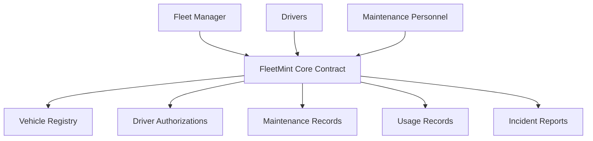

# FleetMint Vehicle Management System

A decentralized vehicle fleet management system using NFTs and smart contracts to manage vehicle operations, maintenance, and driver authorizations.

## Overview

FleetMint is a comprehensive blockchain-based solution for managing vehicle fleets that leverages smart contracts to provide:

- Vehicle registration and tracking using NFTs
- Driver authorization management
- Maintenance scheduling and record-keeping
- Usage tracking and fuel allocation
- Incident reporting and management
- Real-time vehicle status monitoring

The system enables fleet managers to maintain transparent, tamper-proof records while automating many aspects of fleet operations through smart contract logic.

## Architecture



The system is built around a core smart contract that manages:
- Vehicle registration and status
- User roles and permissions
- Driver authorizations
- Maintenance and usage records
- Incident reporting

## Contract Documentation

### FleetMint Core Contract

The main contract managing all fleet operations and data storage.

#### Key Components:

1. **Vehicle Management**
   - Vehicle registration with detailed metadata
   - Status tracking (available, assigned, maintenance, out-of-service)
   - Mileage and fuel budget management

2. **User Roles**
   - Admin
   - Maintenance Personnel
   - Driver

3. **Authorization System**
   - Driver-to-vehicle assignments
   - Time-bound authorizations
   - Usage limits

4. **Record Keeping**
   - Maintenance history
   - Usage logs
   - Incident reports

## Getting Started

### Prerequisites

- Clarinet
- Stacks wallet
- Basic understanding of Clarity smart contracts

### Installation

1. Clone the repository
2. Install dependencies
```bash
clarinet install
```

### Basic Usage

1. **Register a Vehicle**
```clarity
(contract-call? .fleetmint-core register-vehicle 
    "Toyota" 
    "Camry" 
    u2023 
    "1HGCM82633A123456" 
    u0 
    u5000 
    u100)
```

2. **Authorize a Driver**
```clarity
(contract-call? .fleetmint-core authorize-driver 
    'ST1PQHQKV0RJXZFY1DGX8MNSNYVE3VGZJSRTPGZGM 
    u1 
    u1625097600 
    u1625184000 
    u1000)
```

## Function Reference

### Administrative Functions

```clarity
(register-vehicle (make (string-ascii 30)) (model (string-ascii 30)) (year uint) (vin (string-ascii 17)) (initial-mileage uint) (maintenance-interval uint) (fuel-budget uint))
(assign-role (user principal) (role-code uint))
(update-vehicle-status (vehicle-id uint) (new-status uint))
```

### Driver Functions

```clarity
(start-vehicle-usage (vehicle-id uint) (purpose (string-utf8 100)))
(end-vehicle-usage (vehicle-id uint) (record-id uint) (end-mileage uint) (fuel-used uint))
(report-incident (vehicle-id uint) (location (string-utf8 100)) (description (string-utf8 200)) (severity uint))
```

### Maintenance Functions

```clarity
(record-maintenance (vehicle-id uint) (maintenance-type (string-ascii 50)) (mileage uint) (cost uint) (notes (string-utf8 200)))
(update-incident-status (vehicle-id uint) (report-id uint) (new-status (string-ascii 20)))
```

## Development

### Testing

Run the test suite:
```bash
clarinet test
```

### Local Development

1. Start local development chain:
```bash
clarinet console
```

2. Deploy contracts:
```bash
clarinet deploy
```

## Security Considerations

### Access Control
- Role-based access control for all sensitive operations
- Time-bound driver authorizations
- Owner-only administrative functions

### Usage Limitations
- Mileage validation
- Fuel budget restrictions
- Maintenance requirements enforcement

### Data Validation
- Input validation for all public functions
- Status transition controls
- Authorization expiration checks

### Known Limitations
- No native integration with IoT devices
- Relies on manual input for mileage and fuel usage
- Limited to on-chain data storage
- Block time dependency for temporal operations